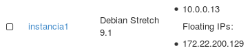

# Vistas (views) en el servidor DNS Bind9

En alguna circunstancia nos puede interesar que un mismo nombre que resuelve nuestro DNS devuelva direcciones IP distintas según en que red este conectada el cliente que realiza la consulta. Por ejemplo:

	* Si tenemos un servidor DNS que da servicio a internet y a intranet. Si se realiza la consulta desde internet, por ejemplo al nombre `www.example.org` debe devolver a la IP pública, sin embago si se hace la misma consulta desde la intranet la resolución deberá ser a una IP privada.
	* Otro ejemplo es en la resolución de nombres de instancias de OpenStack. En este caso una instancia tiene asignada una IP privada en el rango en el que hemos configurado la red interna, además puede tener asignada una IP flotante en el rango de la configuración que hayamos hecho de la red externa. En este caso sería deseable que cuando hago una consulta desde el exterior me resuelva con la IP flotante, y cuando haga una consulta desde otra instancia conecta da a la red interna me devuelva la dirección fija asignada a la instancia.

Vamos a ver un ejemplo del uso de vistas (views) en bind9 para configurar dos zonas diferenciadas para el mismo nombre de dominio y que se utilicen según desde donde se solicite la resolución.

## Escenario de nuestro ejemplo

Hemos creado una instancia en OpenStack con el siguiente esquema de red:

La red intena tiene como direccionamiento 10.0.0.0/24 y la red externa 172.22.0.0/16. Vamos a configurar bind9 para que cuando se consulte el nombre del servidor desde la red externa devuelva la ip flotante (172.22.0.129) y cuando la consulta se realice desde la red interna se devuelva la ip fija (10.0.0.13).

## Uso de vistas en bind9

Al utilizar "views" en bind9 vamos a tener zonas diferencias según el origen de la consulta. Por lo tanto vamos a crear dos "acl" par filtrar la red desde la que se hace la consulta y posteriormente dentro de cada vista definiremos las zonas con autoridad del servidor. De esta manera el fichero `/etc/bind/named.conf.local` quedaría de la siguiente manera:

	acl interna { 10.0.0.0/24; localhost; };
	acl externa { 172.22.0.0/16; };
	view interna {
	    match-clients { interna; };
	    allow-recursion { any; };
	    include "/etc/bind/zones.rfc1918";	

	        zone "example.org"
	        {
	                type master;
	                file "db.interna.example.org";
	        };
	        zone "0.0.10.in-addr.arpa"
	        {
	                type master;
	                file "db.0.0.10";
	        };
	};	

	view externa {
	    match-clients { externa; };
	    allow-recursion { any; };
	    include "/etc/bind/zones.rfc1918";	

	        zone "example.org"
	        {
	                type master;
	                file "db.externa.example.org";
	        };
	        zone "22.172.in-addr.arpa"
	        {
	                type master;
	                file "db.22.172";
	        };	

	};
